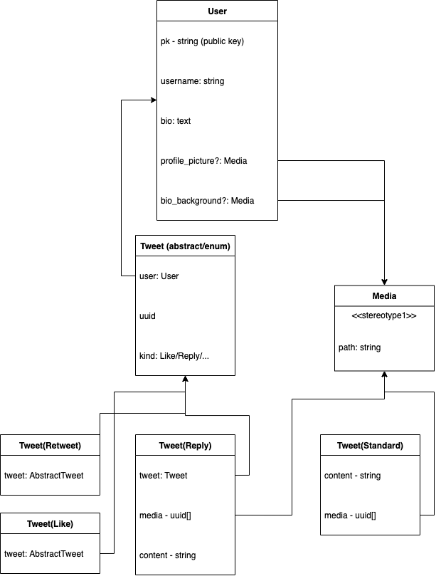

# Twitter Clone

## Domain Model

The fundamental part of the system is a User, the user can `create()` many `Tweet` objects,
a tweet object can be `liked()` by other Users. A Tweet has three kinds; regular, reply, and retweet.

A user has a `ProfilePage`, which shows tweets belonging to the user & the `ProfileInformation` object.

Certain objects (such as `ProfilePage` and `Tweet`) may have 0..n associated media objects.

This `Media` object contains a file (limited to video/image files), and an optional `kind` (for cases in which different media objects
serve different purposes, such as a bio image/profile picture). In the case of a `Tweet` with `Media`, the associated `Media` objects
have no kind. They are implicitly seen as "attachments".

A user has a profile picture, and a bio, and a profile background image.

User capabilities;

A user can:
- Search
- Post a tweet
- Follow an account
- Unfollow an account
- Like a tweet
- Retweet a tweet
- Reply to a tweet
- View tweets (homepage)
- View profile